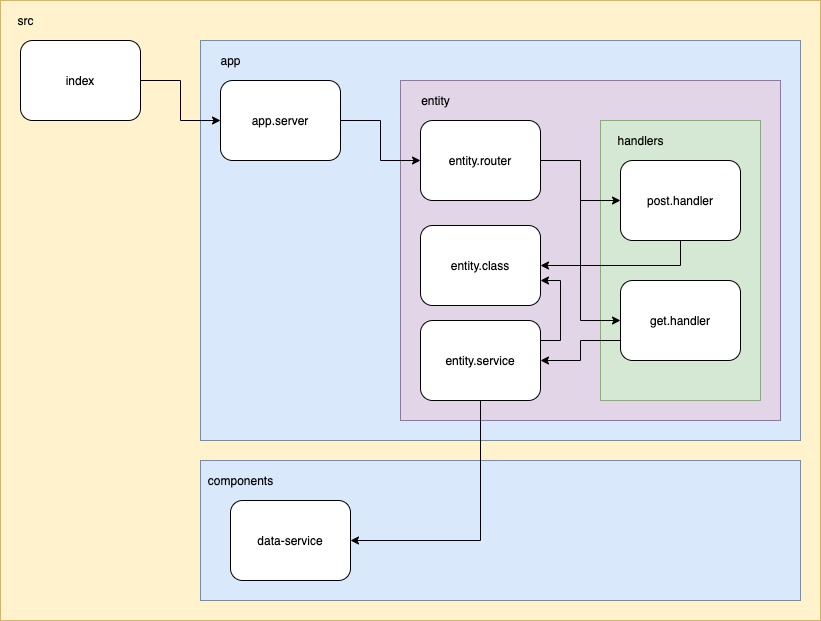

# TypeScript for NodeJS

## Introduction

Thank you for participating in the TypeScript for NodeJS course!
Here, you'll find instructions for completing your certification.

### Live Sessions

* [Session 1](./session-1.md)
* [Session 2](./session-2.md)
* [Session 3](./session-3.md)
* Session 4

## The Challenge

The purpose of the challenge is for you to demonstrate your TypeScript skills on NodeJS. This is your chance to show off everything you've learned during the course!

You will build and deliver a whole NodeJS project written with TypeScript on your own. We know that not every project is written from scratch, but it's an excellent idea to know how the typescript got configurated. We hope you find this exercise challenging and engaging.


## The Cake Factory

The goal is to create a NodeJS application to build a RESTful API for a cake factory. This API will be able to manage all the cakes of a factory and be able to perform the sales operations for each cake in the factory. This application must be written in TypeScript.

### Requirements

These are the main requirements we will evaluate:

- Use all that you've learned in the course:
  - TypeScript basics
  - HTTP Express server
  - HTTP request handlers
  - Custom tipes
  - Custom data structures (Enum, Class, Interface)
  - Database access
  - Unit testing
  - Architecture
  - Best practices

### Functional requirements

A backend NodeJS application for a Webserver with RESTful access architecture to perform the cakes operations.

The cakes operations will be accessible under the route `/cakes`, and the sales operations will be accessible under the route `/sales`.

#### Cakes operations

* **Register new cakes**. Creates a new record in the database for the cake. This endpoint can receive the following information about the cake and it's restrictions:

  * **Name**: Required, 5 characters min., 50 characters max.
  * **Descrition**: Required, 50 characters min., 1000 characters max.
  * **Ingredients**: Required, at least 3 ingredientes. Per ingredient: 1 character min. 20 chareacters max.
  * **Price**: Required, greater than 0.
  * **Stock**: Required, greater than -1.

* **List cakes**. Returns all cakes registered in the database. This list can be filtered for a range of price or by ingrediente.

* **Cake detail**. Returns the full detail of a cake, receiving the id of the cake.

* **Edit cake**. Updates the cake record in the database. This endpoint should receive the same information as the create operation, and should perform the same restrictions.

#### Sales operations

* **Sell cake**. Creates a new record in the database for the cake sell operation. This endpoint should save the customer information, cake and quantity. Should recieve the folloing information with restrictions:

  * **Customer name**: Required, 3 characters min., 50 characters max.
  * **Phone Number**: Required, 10 characters min, Only numbers, spaces and the sing `+`.
  * **Email**: Optional, 5 characters min. 100 characters max, email format.
  * **Cake ID**: Required, should be a valid, should exists in the database.
  * **Quantity**: Required, greater than 1.

### Business rules

1. Each time that cake is sold, the stock should decrease depending on the quantity bought by the customer.
2. Cannot be sold a quantity greater than the current stock.
3. When the stock is greater than 10, the status of the cake is `Available`.
4. When the stock is less than 10, the status of the cake is `LastUnits`.
5. When the stock is 0, the status of the cake is `OutOfStock`.


### Schemas

```typescript
Cake {
  name: string
  descrition: string
  ingredients: string[]
  price: number
  stock: number
  status: 'Available'|'LastUnits'|'OutOfStock'
}

Sell {
  customerName: string
  customerPhoneNumber: string
  customerEmail: string
  totalAmount: number
  cake: {
    name: string
    descrition: string
    ingredients: string[]
    price: number
    quantity: number
  }
}
```

### Architecture (files distribution)



### Bonus points

Create an endpoint to under the `sales` route to list all the sells by week number of the year. This endpoint sould return all the sales of a giving week and year. Ex. `/sales?year=2020&week=3 -> [Sale, ...]`.

The endpoint should return an error if the week number is not valid for the given name.

## Deliverables

We provide the delivery dates so you can plan accordingly; please take this challenge seriously and try to make progress constantly.

It’s worth mentioning that you’ll ONLY get feedback from the review team for your first deliverable, so you will have a chance to fix or improve the code based on our suggestions.

For the final deliverable, we will provide some feedback, but there is no extra review date. If you are struggling with something, contact your mentor and peers to get help on time. Feel free to use the slack channel available.

You can provide each deliverable through the following form: https://bit.ly/typescriptfornodejsdeliverable

### First Deliverable (due November 24th 23:59PM)

Based on the self-study material and live session covered until this deliverable, we suggest you perform the following:

- Configure the `npm` project
- Cofnigure the TypeScript project
- Create the application main entry point
- Create the HTTP server
- Load configurations from `.env` file.


### Second Deliverable (due November 27th 23:59PM)

Based on the self-study material and live session covered until this deliverable, we suggest you perform the following:

- Create all routers for the projects routes
- Handle all the endponts
- Mimic a database read with time intervals and promises
- Create your clases, interfaces an Enums


### Third Deliverable (due December 1st 23:59PM)

Based on the self-study material and live session covered until this deliverable, we suggest you perform the following:

- Create your database models
- Create functions to perform read/write DB operations
- Apply database to the endpoints
- Perform all the logic and business rules

## Final Deliverable (due December 6th 23:59PM)

Based on the self-study material and live session covered until this deliverable, we suggest you perform the following:

- Create unit testing for the application
- Configurations for production deployment
